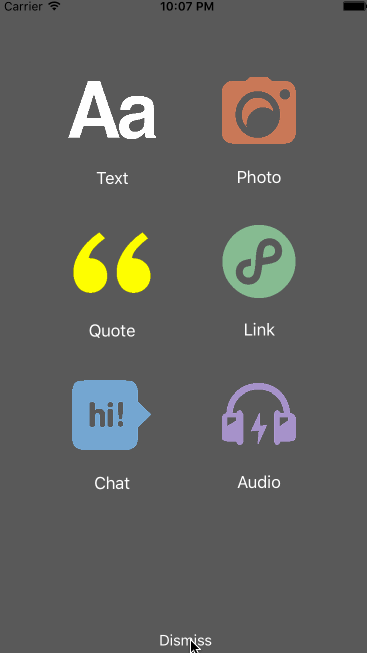

# TumblrMenuDemo
A custom menu controller

参照了[30 Days of Swift](https://github.com/allenwong/30DaysofSwift/tree/master/Project%2017%20-%20TumblrMenu)中的TumblrMenu。

主要是`UIViewControllerAnimationTransitioning`协议和`UIViewControllerTransitioningDelegate`协议的运用

效果图如下

